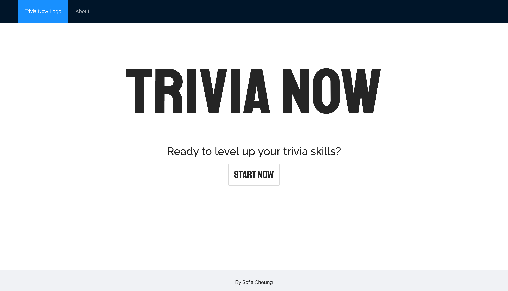

# Trivia Now
A web application where you can practice your trivia skills by answering random questions, made with JavaScript.

# Features
- Homepage with navigation
- A user session using cookies.
- 10 questions per quiz.
- A question has 4 options and one correct answer among them.
- A score at the end of every quiz.
- Questions in are randomized in every quiz.
- Options are randomized in every question.

# Technologies and Dependencies
- `React`: To use function components, hooks and Context API
- `Ant Design` (antd): To costumize structure with styling using Ant Design components
- `CSS`: Styling React and Ant Design components
- `Jest` and `Enzyme`: To test React components
- `react-cookie`: Package used to access and create cookies on the browser
- `react-router-dom` (React Router): Use components to handle routing in the application
- `Eslint`: Linter tool for JavaScript code
- See [package.json](./package.json) for more details

# How To Use
To run project locally, make sure you have `NodeJs` and `npm` installed in your computer.
1. Clone the repository by running `git clone git@github.com:Svcg17/trivianow.git` 
2. Change to the `trivianow` directory by running `cd trivianow`
2. Run `npm install` to install the project's dependencies
3. Run `npm start` to start the React server on port `3000`
4. You can now view Trivia Now on the browser by going to `http://localhost:3000`

# Improvements
- Learn how to test `useContext` hooks in order to be able to test `Trivia` and `UserForm` components.
- Increase number of tests per React component.
- Implement a high score system where the user can see all the scores of each quiz they have completed.
- Add progress bar to let users know how far along in the quiz they are.

# Author
Sofia Cheung Guardia - [Linkedin](https://www.linkedin.com/in/sofiacheung/)